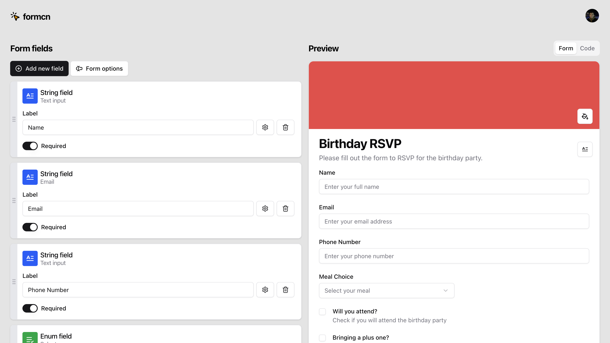

# formcn

<div align="center">
  
  <p><em>formcn is a visual form builder with real-time preview</em></p>
</div>

## About
Build beautiful, type-safe forms with shadcn/ui, React Hook Form, and Zod. An AI-powered visual form builder that generates production-ready React code.


## 🛠️ Tech Stack

- **Framework:** [Next.js 15](https://nextjs.org/) (App Router)
- **Language:** [TypeScript](https://www.typescriptlang.org/)
- **AI:** [OpenAI GPT-4](https://openai.com/) with [Vercel AI SDK](https://sdk.vercel.ai/)
- **Form Management:** [React Hook Form](https://react-hook-form.com/) + [Zod](https://zod.dev/)
- **UI Components:** [shadcn/ui](https://ui.shadcn.com/) + [Radix UI](https://www.radix-ui.com/)
- **Styling:** [Tailwind CSS](https://tailwindcss.com/)
- **State Management:** [Zustand](https://zustand-demo.pmnd.rs/)
- **Authentication:** [NextAuth.js](https://next-auth.js.org/)
- **Drag & Drop:** [@dnd-kit](https://dndkit.com/)
- **Code Highlighting:** [Shiki](https://shiki.style/)
- **Animations:** [Motion](https://motion.dev/)

## 🚀 Getting Started

### Prerequisites

- Node.js 20.x or higher
- npm
- GitHub OAuth App (for authentication)
- OpenAI API Key (for AI form generation)

### Installation

1. **Clone the repository**

```bash
git clone https://github.com/yourusername/formcn.git
cd formcn
```

2. **Install dependencies**

```bash
npm install
```

3. **Set up environment variables**

Create a `.env.local` file in the root directory:

```env
# NextAuth Configuration
AUTH_SECRET=your-auth-secret-here
AUTH_GITHUB_ID=your-github-oauth-app-id
AUTH_GITHUB_SECRET=your-github-oauth-app-secret

# OpenAI Configuration
OPENAI_API_KEY=your-openai-api-key-here
```

4. **Run the development server**

```bash
npm run dev
```

5. **Open your browser**

Navigate to [http://localhost:3000](http://localhost:3000)

## 📖 Usage

### AI-Powered Form Generation

1. Visit the home page
2. Sign in with GitHub
3. Enter a prompt describing your form (e.g., "Create a contact form with name, email, and message fields")
4. Press Enter or click the submit button
5. Your form will be generated and opened in the playground

### Manual Form Building

1. Click "Or, get started without AI" on the home page
2. Click "Add field" in the playground
3. Choose your field type (String, Enum, or Boolean)
4. Configure field properties:
   - **Label** - Display name for the field
   - **Placeholder** - Hint text
   - **Format** - Rendering style (input, textarea, select, etc.)
   - **Validation** - Required/optional and other rules
5. Customize form appearance using "Form options"
6. View real-time preview on the right panel
7. Switch to "Code" tab to see and copy the generated React component

### Form Customization Options

- **Heading & Description** - Add titles and descriptions to your form
- **Submit Button** - Customize text, color, and width
- **Background** - Add colorful backgrounds with various Tailwind colors
- **Field Ordering** - Drag and drop to reorder fields

## 🎯 Supported Field Types

### String Fields
- **Input** - Single-line text input
- **Textarea** - Multi-line text input
- **Email** - Email input with validation
- **Password** - Password input with masking

### Enum Fields (Multiple Choice)
- **Select** - Dropdown selection
- **Radio** - Radio button group
- **Combobox** - Searchable select with autocomplete

### Boolean Fields
- **Checkbox** - Single checkbox
- **Switch** - Toggle switch

## 📁 Project Structure

```
formcn/
├── src/
│   ├── app/                      # Next.js App Router pages
│   │   ├── (pages)/
│   │   │   └── playground/       # Form builder playground
│   │   ├── api/
│   │   │   ├── auth/             # NextAuth endpoints
│   │   │   └── chat/             # AI form generation endpoint
│   │   ├── layout.tsx            # Root layout
│   │   └── page.tsx              # Home page with prompt bar
│   ├── actions/                  # Server actions
│   │   └── auth/                 # Authentication actions
│   ├── components/               # React components
│   │   ├── auth/                 # Auth-related components
│   │   ├── colors/               # Color picker components
│   │   ├── playground/           # Playground UI components
│   │   │   ├── form-fields/      # Field configuration
│   │   │   ├── live-preview/     # Preview and code display
│   │   │   └── toolbar/          # Playground toolbar
│   │   ├── ui/                   # shadcn/ui components
│   │   ├── header.tsx            # Main header
│   │   └── prompt-bar.tsx        # AI prompt input
│   ├── core/                     # Core business logic
│   │   ├── code-gen/             # Code generation logic
│   │   ├── static/               # Static configurations
│   │   └── types/                # TypeScript type definitions
│   ├── hooks/                    # Custom React hooks
│   ├── lib/                      # Utility functions
│   ├── services/                 # API services
│   │   └── chat.ts               # AI form generation service
│   ├── static/                   # Static data
│   │   ├── tailwind-colors.ts    # Color configurations
│   │   └── templates.ts          # Form templates
│   ├── stores/                   # Zustand stores
│   │   └── playground.ts         # Playground state management
│   ├── auth.ts                   # NextAuth configuration
│   └── middleware.ts             # Next.js middleware
├── public/                       # Static assets
├── components.json               # shadcn/ui configuration
├── next.config.ts                # Next.js configuration
├── tailwind.config.ts            # Tailwind CSS configuration
├── tsconfig.json                 # TypeScript configuration
└── package.json                  # Dependencies and scripts
```

## 🔧 Development

### Available Scripts

- `npm run dev` - Start development server with Turbopack
- `npm run build` - Build for production
- `npm start` - Start production server
- `npm run lint` - Run ESLint

### Code Generation

The app generates production-ready code including:
- Zod validation schemas
- React Hook Form integration
- TypeScript types
- shadcn/ui components
- Proper form submission handlers

Generated code follows web standards and best practices for React applications.

## 🔐 Authentication

Authentication is handled by NextAuth v5 with GitHub OAuth provider. Users must sign in to:
- Generate forms using AI
